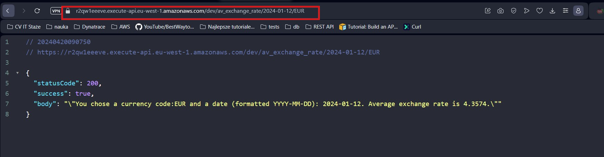
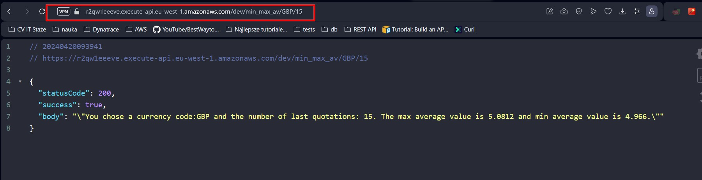
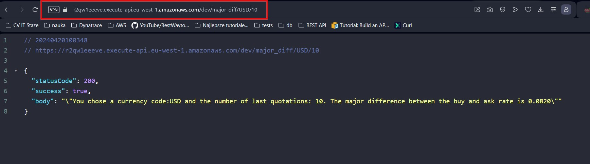
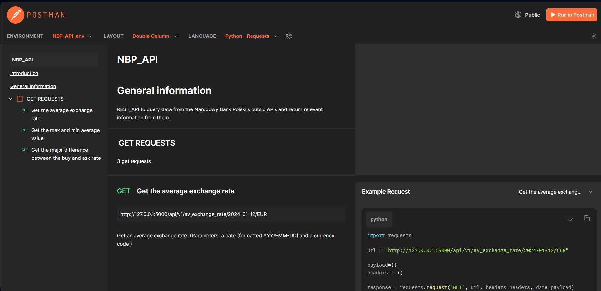
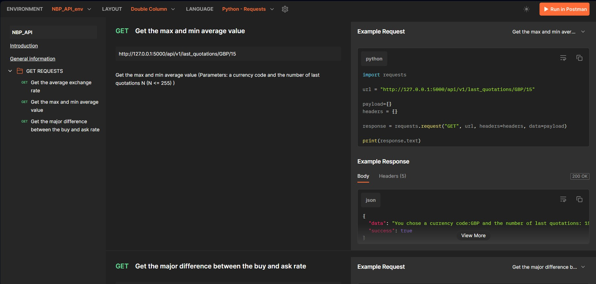
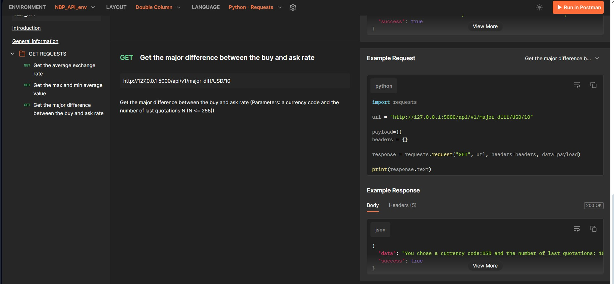

# NBP_API

REST_API to query data from the Narodowy Bank Polski's public APIs and return relevant information from them.

## Table of Contents

* [General Info](#general-information)
* [Technologies Used](#technologies-used)
* [Features](#features)
* [Previews](#Previews)
* [Setup](#setup)
* [Project Status](#project-status)
* [Room for Improvement](#room-for-improvement)
* [Contact](#contact)
* [License](#license)

## General Information

REST API to query data from the NBP public API. 

### Postman

The documentation can be found 
```buildoutcfg
https://documenter.getpostman.com/view/24234549/2sA2xpTpBw
```

### AWS invoke url
```buildoutcfg
https://r2qw1eeeve.execute-api.eu-west-1.amazonaws.com/dev
```

#### Average exchange rate operation:
```buildoutcfg
https://r2qw1eeeve.execute-api.eu-west-1.amazonaws.com/dev/av_exchange_rate/{user_date}/{curr_code}
```
User gives 2 path parameters: 
{user_date} - a date (formatted YYYY-MM-DD) (example 2024-01-12)
{curr_code}  - a currency code (example EUR)

example:
```buildoutcfg
https://r2qw1eeeve.execute-api.eu-west-1.amazonaws.com/dev/av_exchange_rate/2024-01-12/EUR
```
#### The max and min average value operation:
```buildoutcfg
https://r2qw1eeeve.execute-api.eu-west-1.amazonaws.com/dev/ min_max_av/{curr_code}/{last_quo}
```
User gives 2 path parameters: 
{curr_code}  - a currency code (example EUR)
{last_quo} - the number of last quotations N (N <= 255) (example 15)

example:
```buildoutcfg
https://r2qw1eeeve.execute-api.eu-west-1.amazonaws.com/dev/min_max_av/GBP/15
```

#### The major difference between the buy and ask rate operation:
```buildoutcfg
https://r2qw1eeeve.execute-api.eu-west-1.amazonaws.com/dev/major_diff/{curr_code}/{last_quo}
```
User gives 2 path parameters: 
{curr_code}  - a currency code (example USD)
{last_quo} - the number of last quotations N (N <= 255) (example 10)

example
```buildoutcfg
https://r2qw1eeeve.execute-api.eu-west-1.amazonaws.com/dev/major_diff/USD/10
```
## Technologies Used

* Python 3.11
* Flask 3.0.2
* Alembic 1.13.1
* SQLAlchemy 2.0.28
* Pytest 8.1.1
* PostgreSQL
* AWS (in progress)
* Postman

## Features

List the ready features here:

1. Given a date (formatted YYYY-MM-DD) and a currency code (list: [https://nbp.pl/en/statistic-and-financial-reporting/rates/table-a/](https://nbp.pl/en/statistic-and-financial-reporting/rates/table-a/)), provide its average exchange rate.
2. Given a currency code and the number of last quotations N (N <= 255), provide the max and min average value (every day has a different average).
3. Given a currency code and the number of last quotations N (N <= 255), provide the major difference between the buy and ask rate (every day has different rates).

## Previews

### AWS Rest Api
### Average exchange rate



### The max and min average value



### The major difference between the buy and ask rate




### Postman

### Average exchange rate



### The max and min average value



### The major difference between the buy and ask rate



## Setup

- Clone repository NBP_API

```buildoutcfg

git clone https://github.com/RockPiryt/NBP_API.git

```

- Enter Project Directory cd NBP_API

```buildoutcfg

cd NBP_API

```

- Create  database
- Rename .env.example to .env and set your calues

```buildoutcfg

# SQLALCHEMY_DATABASE_URI template

SQLALCHEMY_DATABASE_URI = f"postgresql://{username_postdb}:{password_postdb}@{host_postdb}/{database_postdb}"

```

- Create a virtual evironment

```buildoutcfg

python -m venv venv

```

- Activate Virtual Environment

```buildoutcfg

source: venv/Scripts/activate

```

- Install packages from requirements.txt

```buildoutcfg

pip install -r requirements.txt

```

- Migrate database

```buildoutcfg

flask db upgrade

```

- Run command

```buildoutcfg

flask run

```

## Project Status

Project is: _in progress_

## Room for Improvement

Room for improvement:

* Unit/integration tests.
* Docker image of the whole application.
* Swagger UI or any other simple front-end (with e.g. React, Angular).
* Add a Postgres Database

## Contact

- Created by [@RockPiryt Github](https://github.com/RockPiryt)
- My Resume [@RockPiryt Resume](https://paulinakimak.com)

Feel free to contact me!

## License

This project is open source and available under the [aa]
